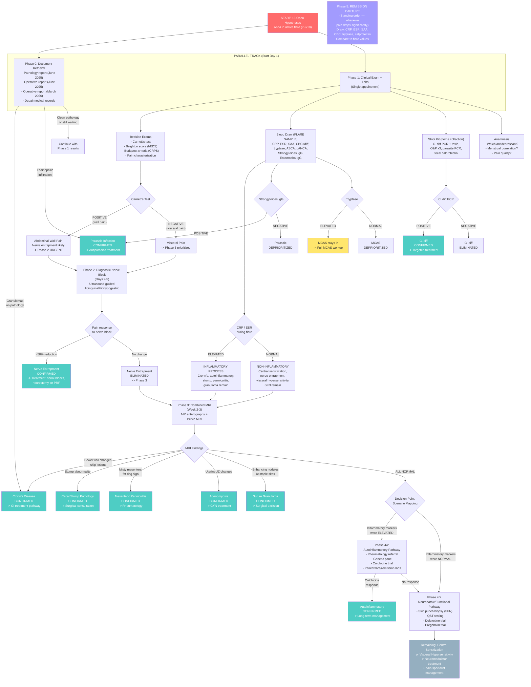

# Diagnostic Triage Plan: Anna Riedl

**Created: April 20, 2026**
**Status: Ready for execution**
**Companion to: [Investigation Report](investigation-report.md)**

---

## Table of Contents

1. [Guiding Principles](#1-guiding-principles)
2. [Decision Flowchart](#2-decision-flowchart)
3. [Phase 0 — Document Retrieval](#3-phase-0--document-retrieval-start-immediately)
4. [Phase 1 — Clinical Exam + Comprehensive Panel](#4-phase-1--single-appointment-clinical-exam--comprehensive-panel)
5. [Phase 2 — Diagnostic Nerve Block](#5-phase-2--diagnostic-nerve-block)
6. [Phase 3 — Combined MRI Session](#6-phase-3--combined-mri-session)
7. [Decision Point: Scenario Mapping](#7-decision-point-re-evaluate-after-phases-03)
8. [Phase 4A — Autoinflammatory Pathway](#8-phase-4a--autoinflammatory-pathway)
9. [Phase 4B — Neuropathic/Functional Pathway](#9-phase-4b--neuropathicfunctional-pathway)
10. [Phase 5 — Remission Capture](#10-phase-5--remission-capture-ongoing)
11. [Timeline Summary](#11-timeline-summary)
12. [Hypothesis Elimination Matrix](#12-hypothesis-elimination-matrix)

---

## 1. Guiding Principles

1. **Anna is currently in a flare (7–9/10 as of mid-April 2026).** Tests that require active symptoms must happen NOW. This is the flare sample window.
2. **Document retrieval and clinical testing run in parallel.** Do not wait for hospital records before starting exams.
3. **Each phase is designed so its results determine whether later phases are needed.** After each phase, surviving hypotheses are re-evaluated before proceeding.
4. **Tests that split the differential in half are prioritized** over tests that only address one hypothesis.
5. **Tests that can be bundled into single appointments or procedures are bundled.** One blood draw, one MRI session, one clinical visit — each covering as many hypotheses as possible.
6. **Safety over comfort, speed over convenience.** We are not optimizing for the most pleasant experience but for the fastest safe path to diagnosis.

---

## 2. Decision Flowchart

**Legend:** Red = start. Green = confirmed diagnosis with treatment path. Yellow = requires further workup. Blue-gray = functional/neuropathic endpoint. Purple = ongoing opportunistic monitoring.

---

## 3. Phase 0 — Document Retrieval (Start immediately)

**Risk to patient:** None
**Effort:** Phone calls, emails, patient portal requests
**Run in parallel with all other phases**

### Documents to Request

| # | Document | Source | Key Question It Answers |
|---|---|---|---|
| 0.1 | **Appendix/cecal pole pathology report** | Hospital that performed June 2025 surgery (Vienna) | What did the resected tissue show histologically? Granulomas → Crohn's. Eosinophilic infiltration → parasitic. Chronic transmural inflammation → ongoing disease process. Normal acute appendicitis → resolved, look elsewhere. |
| 0.2 | **Operative report, June 2025 appendectomy** | Same hospital | What made the surgery "complicated"? What closure technique was used for the cecal stump (staples vs. sutures, type)? Were there intraoperative complications (bleeding, perforation, conversion)? How much cecum was resected? |
| 0.3 | **Operative report, March 2026 laparoscopy** | Hospital that performed March 2026 surgery | What were the "many small interventions"? What "various things" were noticed? Was the cecal stump specifically visualized? Were biopsies taken? What was the state of the peritoneum, mesentery, bowel? |
| 0.4 | **Dubai medical records** (Dec 2024 hospitalization + Jan–Mar 2025 visits) | Dubai hospital (Anna must identify which facility) | Original imaging, lab results, which antibiotics were given, what the diagnostic reasoning was, whether any differential besides appendicitis was considered |

### Why This Phase Could End the Investigation

The pathology report (0.1) is the single most decisive document in the case:

- **If granulomas are present:** Crohn's disease is near-confirmed. Skip directly to GI specialist for Crohn's-specific treatment. Most other hypotheses become secondary or moot.
- **If eosinophilic infiltration or organisms are present:** Parasitic infection is confirmed. Treat with ivermectin (Strongyloides) or metronidazole (Entamoeba) depending on findings. If the parasite was the root cause of the "appendicitis," the entire downstream cascade was a consequence of a missed diagnosis.
- **If the pathology is clean (simple acute appendicitis):** Crohn's and parasitic drop significantly. Remaining hypotheses compete.

The March 2026 operative report (0.3) is the second most important. The vague "many small interventions" could include things like:
- Lysis of a single adhesive band (relevant to hypothesis 9.9)
- Biopsy of a suspicious nodule (relevant to 9.6, 9.10)
- Manipulation near the cecal stump (relevant to 9.4)
- Excision of a small granuloma (relevant to 9.6 — and could explain the temporary remission)

**Action items for Anna:**
1. Call the Vienna surgical hospital. Request pathology report and operative note from June 2025 surgery. In Austria, patients have a legal right to their medical records (PatientInnenverfügungsgesetz / DSGVO Art. 15).
2. Call the hospital that performed the March 2026 laparoscopy. Request the full operative report and any biopsy/pathology results.
3. Identify the Dubai hospital where the December 2024 hospitalization occurred. Request full medical records. This may require contacting the hospital's medical records department directly; Dubai Health Authority (DHA) facilities typically have patient portals.

---

## 4. Phase 1 — Single Appointment: Clinical Exam + Comprehensive Panel

**When:** Day 1 (as soon as appointment can be secured)
**Duration:** 30–45 minutes clinical time + stool collection over the following 3 days
**Risk to patient:** Minimal (blood draw, physical exam)
**Prerequisite:** She must still be in a flare (7+ pain). If she enters remission before this appointment, the blood draw loses its flare-sample value — but the clinical exams remain valid.

### 1A. Bedside Clinical Exams

These require no equipment, no preparation, and no waiting. They can be done by any physician in any setting.

#### Carnett's Test (30 seconds)

**Procedure:** Patient lies supine. Physician identifies the point of maximum abdominal tenderness by palpation. Patient then lifts her head and shoulders off the table (tensing the abdominal wall muscles) while the physician presses on the same point.

**Interpretation:**
- **Pain INCREASES with wall tension (positive Carnett's):** The pain source is in the abdominal wall — a nerve, scar, or neuroma. This makes nerve entrapment (9.3) the leading hypothesis and deprioritizes all visceral causes.
- **Pain DECREASES or stays the same with wall tension (negative Carnett's):** The pain source is visceral (inside the abdominal cavity) — the tensed muscles are shielding the tender organ from the examiner's hand. Visceral causes (Crohn's, stump, visceral hypersensitivity) take priority.

**Diagnostic value:** Splits the entire differential approximately in half with a 30-second bedside maneuver.

#### Beighton Score for Joint Hypermobility (3 minutes)

**Procedure:** Standardized 9-point scoring system assessing hypermobility at 5 sites (bilateral small finger extension >90 degrees, bilateral thumb to forearm, bilateral elbow hyperextension >10 degrees, bilateral knee hyperextension >10 degrees, forward flexion with palms flat on floor).

**Interpretation:**
- **Score ≥5/9 + systemic features (skin hyperextensibility, atrophic scarring, easy bruising, chronic fatigue, pelvic floor dysfunction):** hEDS (9.15) remains a viable hypothesis. Proceed with full 2017 criteria assessment.
- **Score <4/9, no systemic features:** hEDS is effectively excluded. This is a rapid, definitive bedside elimination.

**Additional observations during exam:** Note any atrophic or widened scarring at the surgical sites (EDS skin finding), skin hyperextensibility (stretch >1.5cm at forearm), and easy bruising.

#### Budapest Criteria Screen for CRPS (5 minutes)

**Procedure:** Clinical assessment of the abdominal surgical sites for:
- Sensory: Allodynia (pain from light touch) or hyperalgesia (exaggerated pain response)
- Vasomotor: Temperature asymmetry or skin color changes
- Sudomotor: Sweating changes or edema
- Motor/trophic: Decreased range of motion, weakness, hair/nail/skin changes

**Interpretation:**
- **Meets Budapest criteria (symptoms in 3+ categories, signs in 2+ categories):** CRPS (9.13) stays in. Pain specialist referral warranted.
- **Does not meet criteria (0–1 categories):** CRPS effectively excluded for abdominal presentation.

#### Pain Quality Characterization (5 minutes — anamnesis)

Ask Anna to describe her pain using these descriptors:
- **Burning, electric, shooting, tingling** → Neuropathic signal (nerve entrapment, SFN, CRPS)
- **Cramping, colicky, waves of pain** → Inflammatory or mechanical signal (Crohn's, obstruction, stump)
- **Deep, diffuse, pressure-like, hard to localize** → Visceral signal (visceral hypersensitivity, central sensitization)
- **Sharp, stabbing, point-localizable** → Structural signal (granuloma, nerve entrapment)

#### Additional Anamnesis Questions

| Question | What a positive answer means |
|---|---|
| Which antidepressant are you on, and has it affected your pain at all? | SNRI (duloxetine/venlafaxine) with partial response → neuropathic component. SSRI → no neuropathic data gained. |
| Is there any correlation between your pain and your menstrual cycle? | Cyclical worsening → adenomyosis (9.7) moves up significantly. |
| Does your pain change with position (standing vs. sitting vs. lying)? | Positional component → mechanical cause (hernia, stump, band). |
| During flares, do you notice any skin flushing, itching, hives, or racing heart? | Yes → MCAS (9.8) stays in even if tryptase is normal. |
| Have you ever had a positive C. diff test or been told you had C. diff? | Direct exclusion or confirmation of 9.11. |

### 1B. Blood Draw (Single Venipuncture — Flare Sample)

**Critical timing:** This blood must be drawn while Anna is in active pain (7+/10). She is currently in a flare as of mid-April 2026. This is the window.

| Marker | Tube | Primary Hypothesis Addressed | What Elevated Means | What Normal Means |
|---|---|---|---|---|
| **CRP** | SST/gold | All inflammatory (9.1, 9.4, 9.6, 9.10, 9.12) | Active inflammatory process somewhere | Deprioritizes all inflammatory hypotheses |
| **ESR** | Lavender/EDTA or black/citrate | All inflammatory | Active inflammation (slower to rise/fall than CRP) | Same as above |
| **SAA (serum amyloid A)** | SST/gold | Autoinflammatory (9.12) | More sensitive than CRP for autoinflammatory conditions | Does not exclude, but lowers probability |
| **CBC with manual differential** | Lavender/EDTA | Parasitic (9.16), inflammatory (all) | **Eosinophilia** → parasitic. **Leukocytosis** → infection/inflammation. **Anemia** → chronic disease | Non-specific if normal |
| **Serum tryptase** | SST/gold | MCAS (9.8) | >11.5 ng/mL or >20% above future baseline → MCAS workup needed | Deprioritizes MCAS (does not fully exclude) |
| **Fecal calprotectin** | Stool (or can be ordered as blood test at some labs) | Crohn's (9.1), C. diff (9.11), stump (9.4) | Intestinal mucosal inflammation present | Strong evidence against active IBD or intestinal inflammation |
| **Strongyloides IgG (ELISA)** | SST/gold | Parasitic (9.16) | Chronic Strongyloides infection → ivermectin treatment | Strongyloides excluded |
| **Entamoeba histolytica IgG** | SST/gold | Parasitic (9.16) | Amoebic infection → metronidazole treatment | Amebiasis excluded |
| **ASCA (IgG + IgA)** | SST/gold | Crohn's (9.1) | ASCA-positive pattern supports Crohn's | Does not exclude Crohn's but lowers probability |
| **p-ANCA** | SST/gold | Crohn's (9.1) vs UC differential | ASCA+/pANCA- = Crohn's pattern | Non-specific |

**Total tubes needed:** Approximately 3–4 tubes (SST, EDTA, possibly citrate). Single venipuncture.

### 1C. Stool Collection Kit (Home Collection Over 3 Days)

Give Anna a stool collection kit at the Phase 1 appointment. She collects samples at home and delivers/ships them to the lab.

| Test | # Samples | Hypothesis Addressed |
|---|---|---|
| **C. difficile: PCR + toxin A/B EIA + GDH antigen** | 1 sample | C. diff (9.11) |
| **Ova & parasites (O&P) microscopy** | 3 samples on separate days | Parasitic (9.16) — broad screen |
| **Stool PCR parasite panel** (Giardia, Entamoeba, Cryptosporidium, Strongyloides if available) | 1 sample | Parasitic (9.16) — higher sensitivity than microscopy |
| **Fecal calprotectin** (if not done via blood) | 1 sample | Crohn's (9.1), stump (9.4), C. diff (9.11) |

### 1D. Expected Eliminations After Phase 1

| Result Pattern | Hypotheses Eliminated or Deprioritized | Hypotheses Strengthened |
|---|---|---|
| CRP/ESR/calprotectin all **normal** during 7–9/10 pain | Crohn's (9.1), autoinflammatory (9.12), panniculitis (9.10), stump inflammation (9.4), suture granuloma (9.6) all drop significantly | Central sensitization (9.2), nerve entrapment (9.3), visceral hypersensitivity (9.5), SFN (9.14) |
| CRP/ESR **elevated** during flare | Central sensitization (9.2), visceral hypersensitivity (9.5), nerve entrapment (9.3), SFN (9.14) drop as sole explanations | Crohn's (9.1), autoinflammatory (9.12), stump (9.4), panniculitis (9.10), granuloma (9.6) |
| Strongyloides IgG **positive** | Most others become secondary | Parasitic (9.16) → **confirmed, treat immediately** |
| C. diff **positive** | — | C. diff (9.11) → **confirmed, treat** |
| Tryptase **elevated** | — | MCAS (9.8) → full workup needed |
| Tryptase **normal** | MCAS (9.8) deprioritized | — |
| Carnett's **positive** | All visceral hypotheses deprioritized | Nerve entrapment (9.3) becomes leading |
| Carnett's **negative** | Nerve entrapment (9.3) as primary cause deprioritized | Visceral causes take priority |
| Beighton **<4**, no systemic signs | hEDS (9.15) eliminated | — |
| Budapest criteria **not met** | CRPS (9.13) eliminated | — |
| Eosinophilia on CBC | — | Parasitic (9.16) strongly supported |
| Menstrual cycle correlation reported | — | Adenomyosis (9.7) moves up |

**Realistic best case for Phase 1: 4–6 hypotheses eliminated in a single appointment.**

---

## 5. Phase 2 — Diagnostic Nerve Block

**When:** Days 2–5 (same week as Phase 1 if possible)
**Duration:** 15–30 minutes for the procedure. Result within 2–6 hours.
**Risk:** Low. Ultrasound-guided injection. Local anesthetic + possible corticosteroid. Transient numbness in the inguinal region. Rare: bleeding, infection at injection site.
**Performed by:** Pain specialist or interventional radiologist with experience in abdominal wall nerve blocks.

### Procedure

Ultrasound-guided diagnostic block of the **ilioinguinal** and **iliohypogastric** nerves at the right lower quadrant (appendectomy trocar site region). Local anesthetic (bupivacaine or ropivacaine) is injected around the nerve under ultrasound visualization.

If initial pain was also at other trocar sites (midline, left lower quadrant), additional blocks at those sites may be warranted — discuss with the performing physician based on Carnett's test localization.

### Interpretation

| Result | Meaning | Next Step |
|---|---|---|
| **>50% pain reduction** lasting for the duration of the anesthetic (4–12 hours depending on agent) | **Nerve entrapment CONFIRMED.** The peripheral nerve is the primary pain generator. | Treatment pathway: serial therapeutic blocks (with corticosteroid), pulsed radiofrequency ablation of the nerve, or surgical neurectomy. If pain spread to midline/URQ persists after block, central sensitization is secondary. |
| **Minimal or no pain reduction** | **Nerve entrapment EXCLUDED** as the primary driver. Pain is visceral or central. | Proceed to Phase 3 (MRI). |
| **Partial reduction (20–50%)** | Nerve contributes but is not the sole cause. Mixed picture — peripheral nerve component + another process. | Proceed to Phase 3, but keep nerve entrapment as a contributing factor. Revisit after other causes are addressed. |

### Why Phase 2 Should Not Be Deferred

- Nerve entrapment is the #3 probability hypothesis (MEDIUM-HIGH).
- The test is fast (one appointment), low-risk, and definitive.
- If positive, it provides an immediate treatment pathway and could short-circuit the entire remaining workup.
- If negative, it cleanly eliminates one hypothesis and confirms the visceral/central direction.
- No other test provides this combination of speed, decisiveness, and probability coverage.

---

## 6. Phase 3 — Combined MRI Session

**When:** Week 2–3 (after Phase 1 labs return and Phase 2 is completed)
**Duration:** 60–90 minutes in the scanner
**Risk:** Low. No radiation. Contrast agent (gadolinium) carries small risk of allergic reaction and is contraindicated in severe renal impairment (check creatinine). Claustrophobia may require mild sedation.
**Performed by:** Radiology department. **CRITICAL: the requesting physician must include specific clinical questions on the referral** (see below).

### Protocol

Combine two MRI protocols in a single session:

1. **MR enterography** (small bowel MRI with oral contrast — e.g., mannitol or PEG solution)
2. **Pelvic MRI** (uterine protocol with gadolinium contrast)

The patient drinks the oral contrast ~45 minutes before the scan. Both protocols are acquired sequentially without repositioning.

### Directed Questions for the Radiologist

The referral/request form must explicitly ask the radiologist to evaluate:

1. **Small bowel:** Wall thickening, enhancement, skip lesions, strictures, fistulae (Crohn's)
2. **Cecal stump:** Residual appendiceal tissue, stump thickening, enhancement, fluid collection, dehiscence (stump pathology)
3. **Mesentery:** Fat stranding, "misty mesentery," fat ring sign, nodularity, lymphadenopathy (panniculitis)
4. **Trocar sites and cecal stump staple line:** Enhancing nodules, soft tissue masses (suture granuloma / foreign body reaction)
5. **Internal hernia:** Mesenteric defects, abnormal bowel configuration, bowel clustering (internal hernia)
6. **Uterus:** Junctional zone thickness, asymmetry, myometrial cysts, heterogeneous myometrium (adenomyosis)

**Without these directed questions, the radiologist will read the scan as "unremarkable" and miss the subtle findings this case requires.**

### Hypotheses Addressed by MRI

| What MRI Evaluates | Hypothesis | Finding If Positive |
|---|---|---|
| Small bowel wall thickening, enhancement, skip lesions | Crohn's (9.1) | Wall thickening >3mm, mucosal enhancement, "comb sign" of mesenteric vessels |
| Cecal stump morphology | Cecal stump pathology (9.4) | Residual tissue, inflammatory enhancement, fluid, stump thickening |
| Mesenteric fat | Mesenteric panniculitis (9.10) | Misty mesentery, fat ring sign, soft tissue nodule in mesenteric root |
| Trocar sites and staple line | Suture granuloma (9.6) | Enhancing nodule at staple/suture site |
| Bowel configuration | Internal hernia (9.9) | Abnormal bowel clustering, mesenteric vessel swirling, closed loop |
| Uterine junctional zone | Adenomyosis (9.7) | JZ >12mm, JZ asymmetry, myometrial cysts |

**Six hypotheses evaluated in a single 60–90 minute session.**

### Expected Eliminations After Phase 3

- **Normal MR enterography + normal stump + normal mesentery:** Crohn's, stump pathology, panniculitis, internal hernia, and suture granuloma all drop to very low probability. Combined with Phase 1 labs, these may be fully excluded.
- **Adenomyosis visible or absent on pelvic MRI:** Adenomyosis confirmed or excluded.
- **If something IS found:** Targeted treatment pathway opens immediately — GI referral for Crohn's, surgical consultation for stump pathology, rheumatology for panniculitis, gynecology for adenomyosis.

---

## 7. Decision Point: Re-evaluate After Phases 0–3

By this point (~2–3 weeks from start), we have:

- Pathology and operative reports (received or in process)
- CRP/ESR/calprotectin/SAA during a flare
- Carnett's test result (wall vs. visceral)
- Beighton score and Budapest criteria (hEDS and CRPS screened)
- Nerve block result (entrapment yes/no)
- Comprehensive MRI of bowel, stump, mesentery, and pelvis
- Parasitic and C. diff screening results
- MCAS tryptase baseline

### Scenario Mapping

| Scenario | Inflammatory Markers | Nerve Block | MRI | Surviving Hypotheses | Next Phase |
|---|---|---|---|---|---|
| **A: Inflammatory + MRI positive** | Elevated | Negative | Abnormal finding | Specific diagnosis identified on MRI | Targeted treatment for that diagnosis |
| **B: Inflammatory + MRI normal** | Elevated | Negative | Normal | Autoinflammatory syndrome (9.12), microscopic Crohn's, occult stump inflammation | **Phase 4A** |
| **C: Non-inflammatory + nerve block positive** | Normal | >50% reduction | N/A (may skip) | Nerve entrapment (9.3) ± secondary central sensitization (9.2) | Treatment: serial blocks / neurectomy / PRF |
| **D: Everything normal** | Normal | Negative | Normal | Central sensitization (9.2), visceral hypersensitivity (9.5), SFN (9.14) | **Phase 4B** |
| **E: Mixed signals** | Mildly elevated or discordant | Partial response | Equivocal | Multiple contributing factors | Combination of 4A + 4B elements |

---

## 8. Phase 4A — Autoinflammatory Pathway

**Trigger:** Scenario B — inflammatory markers elevated during flare, but MRI is normal.
**When:** Week 4+
**Goal:** Identify or exclude autoinflammatory syndrome as the cause of episodic inflammatory abdominal pain.

### Step 4A.1 — Rheumatology Referral

Anna needs a rheumatologist experienced in autoinflammatory conditions (not just rheumatoid arthritis). In Vienna, the AKH (Allgemeines Krankenhaus) has an autoinflammatory diseases clinic. Request should mention the episodic pain pattern and elevated inflammatory markers.

### Step 4A.2 — Autoinflammatory Genetic Panel

Blood test. Send to a genetics lab with autoinflammatory panel capability.

| Gene | Condition |
|---|---|
| MEFV | FMF (low prior given ancestry, but cheap to include) |
| TNFRSF1A | TRAPS (TNF receptor-associated periodic syndrome) |
| MVK | MKD / HIDS (mevalonate kinase deficiency) |
| NLRP3 | CAPS (cryopyrin-associated periodic syndromes) |
| NOD2 | Blau syndrome / Crohn's-associated variants |

A positive result is diagnostic. A negative result does not fully exclude autoinflammatory disease (somatic mosaicism, undiscovered genes), but significantly lowers probability.

### Step 4A.3 — Therapeutic Trial of Colchicine

**Dose:** 0.5 mg twice daily for 4 weeks.
**Monitoring:** Liver function, CBC at 2 weeks (colchicine has narrow therapeutic index).

**Interpretation:**
- **Pain resolves or markedly improves within 1–2 weeks:** Autoinflammatory serositis strongly supported. Colchicine becomes long-term treatment. Diagnosis: likely undifferentiated autoinflammatory syndrome with peritoneal involvement.
- **No improvement after 4 weeks:** Colchicine-responsive autoinflammatory conditions excluded. If IL-1 pathway still suspected → proceed to anakinra trial.

### Step 4A.4 — Anakinra Trial (if colchicine fails)

**Dose:** 100 mg subcutaneous daily.
**Key feature:** Rapid onset of action (often <48 hours). If pain dramatically improves within 2 days, IL-1-mediated autoinflammatory condition is near-certain.
**Cost/access:** Expensive; may require insurance pre-authorization. In Austria, available through hospital pharmacies.

---

## 9. Phase 4B — Neuropathic/Functional Pathway

**Trigger:** Scenario D — all inflammatory, structural, infectious, and peripheral nerve causes excluded. Inflammatory markers normal during flare. Nerve block negative. MRI normal.
**When:** Week 4+
**Goal:** Diagnose or treat central nervous system dysfunction as the pain driver.

### Step 4B.1 — Skin Punch Biopsy for Small Fiber Neuropathy

**Procedure:** Two 3mm skin punch biopsies — one from the affected abdominal area, one from a control site (e.g., lateral thigh). Processed for intraepidermal nerve fiber density (IENFD) using PGP9.5 immunostaining.
**Risk:** Minimal. Local anesthetic. Two small wounds that heal in ~1 week.
**Result time:** 2–3 weeks.

**Interpretation:**
- **Reduced IENFD at abdominal site:** Small fiber neuropathy (9.14) confirmed. Treatment: identify and treat underlying cause (autoimmune, metabolic), gabapentinoids, or IV immunoglobulin if autoimmune SFN.
- **Normal IENFD:** SFN excluded. Central sensitization or visceral hypersensitivity remain.

### Step 4B.2 — Quantitative Sensory Testing (QST)

**Procedure:** Standardized battery of sensory tests (thermal detection thresholds, thermal pain thresholds, mechanical detection/pain thresholds, vibration, pressure) applied to the affected area and a control area.
**Available at:** University pain clinics. In Vienna, AKH pain department.
**Risk:** None. Non-invasive.

**Interpretation:**
- **Altered thresholds (lowered pain thresholds, enhanced temporal summation, impaired conditioned pain modulation):** Central sensitization (9.2) confirmed objectively.
- **Normal thresholds:** Central sensitization is less likely as the sole cause.

### Step 4B.3 — Neuromodulator Therapeutic Trials

If Anna is not already on a neuropathic pain agent, start sequential trials:

| Trial | Dose | Duration | What Response Means |
|---|---|---|---|
| **Duloxetine** (SNRI) | Start 30mg, titrate to 60mg | 4–6 weeks | Response confirms neuropathic/central component. Continue as treatment. |
| **Pregabalin** (if duloxetine fails or she's already on SNRI) | Start 75mg BID, titrate to 150mg BID | 4–6 weeks | Response confirms neuropathic component, particularly if gabapentinoid-responsive. |
| **Amitriptyline** (low-dose TCA) | Start 10mg at bedtime, titrate to 25–50mg | 4–6 weeks | Response supports visceral hypersensitivity (TCAs are first-line for functional abdominal pain). |

**Important:** Only one agent at a time. Allow adequate trial duration. If Anna is already on an SSRI, it must be cross-tapered to duloxetine (not added on top — serotonin syndrome risk).

---

## 10. Phase 5 — Remission Capture (Ongoing)

**Trigger:** Whenever Anna's pain drops significantly (below 3/10 or she reports feeling substantially better)
**Priority:** HIGH. She has had only two remissions in 10 months. The next one is a rare diagnostic opportunity.

### Standing Order

The moment Anna reports significant pain reduction, she should go to a lab **that same day or the next morning** for:

| Marker | Purpose |
|---|---|
| CRP | Compare to Phase 1 flare value |
| ESR | Compare to Phase 1 flare value |
| SAA | Compare to Phase 1 flare value |
| CBC with differential | Compare eosinophils, WBC |
| Serum tryptase | Compare to Phase 1 flare value (MCAS can show flare/baseline delta) |
| Fecal calprotectin | Compare to Phase 1 flare value |

### Interpretation of Paired Results

| Pattern | Meaning |
|---|---|
| **Inflammatory markers elevated during flare, normal during remission** | Episodic inflammatory process confirmed. Strongly supports autoinflammatory (9.12), Crohn's flare (9.1), or other inflammatory etiology. |
| **Inflammatory markers identical (both normal or both elevated)** | Pain fluctuations are not driven by systemic inflammation. Supports neuropathic/functional (central sensitization, visceral hypersensitivity). |
| **Tryptase elevated during flare, normal during remission** | MCAS strongly supported. |

### Logistics

Anna should have a **pre-printed lab order** that she can take to any lab at short notice. The order should be prepared during Phase 1 and kept ready. Remissions in this case have been brief (~2–3 weeks) and their onset unpredictable — there may be only a few days to capture the window.

---

## 11. Timeline Summary

| Phase | When | Duration | Patient Burden | Hypotheses Potentially Resolved |
|---|---|---|---|---|
| **0: Document Retrieval** | Start now | Ongoing (parallel to all phases) | Phone calls only | Crohn's, stump, parasitic (if pathology is definitive) |
| **1: Clinical + Labs** | Day 1 | 1 appointment + 3 days stool collection | 1 blood draw, physical exam | hEDS, CRPS, MCAS, parasitic, C. diff, inflammatory vs. non-inflammatory split |
| **2: Nerve Block** | Days 2–5 | 1 appointment, result in hours | Injection (mild discomfort) | Nerve entrapment |
| **3: Combined MRI** | Week 2–3 | 1 session, 60–90 min | MRI (claustrophobia; oral contrast) | Crohn's, stump, panniculitis, granuloma, hernia, adenomyosis |
| **Decision Point** | Week 3 | Assessment only | None | Route to Scenario A/B/C/D/E |
| **4A: Autoinflammatory** | Week 4+ (if Scenario B) | 4–8 weeks for trials | Blood draw, daily medication | Autoinflammatory syndrome |
| **4B: Neuropathic** | Week 4+ (if Scenario D) | 4–6 weeks per trial | Skin biopsy, daily medication | SFN, central sensitization, visceral hypersensitivity |
| **5: Remission Capture** | Opportunistic | 1 lab visit when remission occurs | Blood draw | Inflammatory vs. functional confirmation |

**Best case:** Pathology report shows granulomas or Strongyloides IgG is positive — investigation resolves at Phase 0/1, within days.

**Realistic case:** By end of Phase 3 (~3 weeks), 16 hypotheses are narrowed to 2–3 with a clear next step for each.

**Worst case:** Phases 0–3 all negative (Scenario D). Sequential neuromodulator trials in Phase 4B, with diagnosis made by therapeutic response over 8–12 weeks.

---

## 12. Hypothesis Elimination Matrix

This matrix shows which phases address which hypotheses, and the expected state of each hypothesis after all phases complete.

| # | Hypothesis | Starting Probability | Phase 0 | Phase 1 | Phase 2 | Phase 3 | Phase 4 | Phase 5 |
|---|---|---|---|---|---|---|---|---|
| 9.1 | **Crohn's Disease** | HIGH | Pathology report (definitive) | CRP, calprotectin, ASCA/pANCA | — | MR enterography | — | Paired markers |
| 9.2 | **Central Sensitization** | HIGH | — | CRP normal supports | Nerve block informs (secondary?) | — | 4B: QST, neuromodulator trial | Paired markers |
| 9.3 | **Nerve Entrapment** | MED-HIGH | Operative reports inform | Carnett's test | **Nerve block (definitive)** | — | — | — |
| 9.4 | **Cecal Stump Pathology** | MED-HIGH | Operative reports (key) | Calprotectin | — | MRI stump evaluation | — | — |
| 9.5 | **Visceral Hypersensitivity** | MEDIUM | — | CRP normal + Carnett's negative supports | Nerve block negative supports | MRI normal supports | 4B: Amitriptyline trial | — |
| 9.6 | **Suture Granuloma** | MEDIUM | March 2026 op report | CRP during flare | — | MRI trocar/staple sites | — | — |
| 9.7 | **Adenomyosis** | MEDIUM | — | Menstrual correlation Q | — | **Pelvic MRI (definitive)** | — | — |
| 9.8 | **MCAS** | MED-LOW | — | Tryptase, skin symptom Q | — | — | Full MCAS workup if tryptase elevated | Paired tryptase |
| 9.9 | **Internal Hernia** | MED-LOW | March 2026 op report | — | — | MRI bowel configuration | — | — |
| 9.10 | **Mesenteric Panniculitis** | MED-LOW | — | CRP during flare | — | MRI mesentery | — | — |
| 9.11 | **C. diff / Dysbiosis** | MED-LOW | — | **Stool C. diff (definitive)** | — | — | — | — |
| 9.12 | **Autoinflammatory** | LOW-MED | — | CRP, ESR, SAA during flare | — | — | **4A: Colchicine/anakinra trial** | **Paired markers (key)** |
| 9.13 | **CRPS** | LOW-MED | — | **Budapest criteria screen** | — | — | — | — |
| 9.14 | **Small Fiber Neuropathy** | LOW-MED | — | CRP normal supports | Nerve block negative supports | — | **4B: Skin punch biopsy (definitive)** | — |
| 9.15 | **hEDS** | LOW-MED | — | **Beighton score screen** | — | — | Full criteria if Beighton positive | — |
| 9.16 | **Parasitic Infection** | LOW-MED | Pathology (eosinophils) | **Strongyloides IgG, stool panel** | — | — | — | — |

**Bold** = the phase that is most likely to be definitive for that hypothesis.

---

*This plan is designed for rapid, safe, parallel execution. Phases 0, 1, and 2 can all begin within the first week. Phase 3 follows within 2–3 weeks. The entire initial triage (Phases 0–3) should be completable in under one month, reducing 16 hypotheses to 2–3 actionable candidates.*
